# Execution Plan

## Project Summary

**Project Type**: Greenfield  
**Request**: Build student progress tracking application for tuition centres focusing on core progress tracking functionality  
**Complexity**: Moderate - Multi-role web application with authentication, data management, visualization, and notifications  
**Risk Level**: Medium - New system with multiple user roles and integration requirements

---

## Detailed Analysis Summary

### Change Impact Assessment

**User-facing changes**: Yes - Complete new user interface for 4 user roles (Teachers, Parents, Students, Centre Administrators)

**Structural changes**: Yes - New multi-tier architecture with:
- Backend API (Java/Spring Boot)
- Frontend SPA (React)
- Authentication service (Keycloak)
- Database (PostgreSQL)
- Notification services (Email/SMS)

**Data model changes**: Yes - New data models for:
- Users (Teachers, Parents, Students, Administrators)
- Students and profiles
- Classes and enrollments
- Subjects and topics
- Tests and scores
- Feedback and notifications

**API changes**: Yes - Complete new REST API for all features

**NFR impact**: Yes - Performance, security, scalability, and monitoring requirements

### Risk Assessment

- **Risk Level**: Medium
- **Rollback Complexity**: Easy (greenfield - no existing system to break)
- **Testing Complexity**: Moderate (multiple user roles, integration points)
- **Key Risks**:
  - Keycloak integration complexity
  - Multi-tenant data isolation
  - Notification service reliability
  - Mobile responsiveness across devices

---

## Workflow Visualization

```mermaid
flowchart TD
    Start(["User Request"])
    
    subgraph INCEPTION["🔵 INCEPTION PHASE"]
        WD["Workspace Detection<br/><b>COMPLETED</b>"]
        RA["Requirements Analysis<br/><b>COMPLETED</b>"]
        US["User Stories<br/><b>COMPLETED</b>"]
        WP["Workflow Planning<br/><b>IN PROGRESS</b>"]
        AD["Application Design<br/><b>EXECUTE</b>"]
        UG["Units Generation<br/><b>EXECUTE</b>"]
    end
    
    subgraph CONSTRUCTION["🟢 CONSTRUCTION PHASE"]
        FD["Functional Design<br/><b>EXECUTE</b>"]
        NFRA["NFR Requirements<br/><b>EXECUTE</b>"]
        NFRD["NFR Design<br/><b>EXECUTE</b>"]
        ID["Infrastructure Design<br/><b>EXECUTE</b>"]
        CG["Code Generation<br/><b>EXECUTE</b>"]
        BT["Build and Test<br/><b>EXECUTE</b>"]
    end
    
    subgraph OPERATIONS["🟡 OPERATIONS PHASE"]
        OPS["Operations<br/><b>PLACEHOLDER</b>"]
    end
    
    Start --> WD
    WD --> RA
    RA --> US
    US --> WP
    WP --> AD
    AD --> UG
    UG --> FD
    FD --> NFRA
    NFRA --> NFRD
    NFRD --> ID
    ID --> CG
    CG --> BT
    BT --> OPS
    OPS --> End(["Complete"])
    
    style WD fill:#4CAF50,stroke:#1B5E20,stroke-width:3px,color:#fff
    style RA fill:#4CAF50,stroke:#1B5E20,stroke-width:3px,color:#fff
    style US fill:#4CAF50,stroke:#1B5E20,stroke-width:3px,color:#fff
    style WP fill:#4CAF50,stroke:#1B5E20,stroke-width:3px,color:#fff
    style AD fill:#FFA726,stroke:#E65100,stroke-width:3px,stroke-dasharray: 5 5,color:#000
    style UG fill:#FFA726,stroke:#E65100,stroke-width:3px,stroke-dasharray: 5 5,color:#000
    style FD fill:#FFA726,stroke:#E65100,stroke-width:3px,stroke-dasharray: 5 5,color:#000
    style NFRA fill:#FFA726,stroke:#E65100,stroke-width:3px,stroke-dasharray: 5 5,color:#000
    style NFRD fill:#FFA726,stroke:#E65100,stroke-width:3px,stroke-dasharray: 5 5,color:#000
    style ID fill:#FFA726,stroke:#E65100,stroke-width:3px,stroke-dasharray: 5 5,color:#000
    style CG fill:#4CAF50,stroke:#1B5E20,stroke-width:3px,color:#fff
    style BT fill:#4CAF50,stroke:#1B5E20,stroke-width:3px,color:#fff
    style OPS fill:#BDBDBD,stroke:#424242,stroke-width:2px,stroke-dasharray: 5 5,color:#000
    style Start fill:#CE93D8,stroke:#6A1B9A,stroke-width:3px,color:#000
    style End fill:#CE93D8,stroke:#6A1B9A,stroke-width:3px,color:#000
    style INCEPTION fill:#BBDEFB,stroke:#1565C0,stroke-width:3px,color:#000
    style CONSTRUCTION fill:#C8E6C9,stroke:#2E7D32,stroke-width:3px,color:#000
    style OPERATIONS fill:#FFF59D,stroke:#F57F17,stroke-width:3px,color:#000
    
    linkStyle default stroke:#333,stroke-width:2px
```



### Text Alternative

```
INCEPTION PHASE:
├─ Workspace Detection (COMPLETED)
├─ Requirements Analysis (COMPLETED)
├─ User Stories (COMPLETED)
├─ Workflow Planning (IN PROGRESS)
├─ Application Design (EXECUTE)
└─ Units Generation (EXECUTE)

CONSTRUCTION PHASE:
├─ Functional Design (EXECUTE - per unit)
├─ NFR Requirements (EXECUTE - per unit)
├─ NFR Design (EXECUTE - per unit)
├─ Infrastructure Design (EXECUTE - per unit)
├─ Code Generation (EXECUTE - per unit)
└─ Build and Test (EXECUTE - all units)

OPERATIONS PHASE:
└─ Operations (PLACEHOLDER)
```

---

## Phases to Execute

### 🔵 INCEPTION PHASE

- [x] **Workspace Detection** - COMPLETED
  - Determined greenfield project with no existing code

- [x] **Requirements Analysis** - COMPLETED
  - Gathered comprehensive functional and non-functional requirements
  - Clarified technology stack, user roles, and MVP scope

- [x] **User Stories** - COMPLETED
  - Created 4 personas and 35 user stories
  - Organized by authentication foundation + user journeys
  - Defined MVP scope (27 stories)

- [x] **Workflow Planning** - IN PROGRESS
  - Creating this execution plan

- [ ] **Application Design** - EXECUTE
  - **Rationale**: New system requires high-level component architecture
  - **Deliverables**:
    - Component identification (API layer, service layer, data layer, frontend components)
    - Component responsibilities and interfaces
    - Service layer design for business logic
    - Data flow between components
    - Integration points (Keycloak, notification services)

- [ ] **Units Generation** - EXECUTE
  - **Rationale**: Complex system with multiple features should be decomposed into manageable units
  - **Deliverables**:
    - Break down system into development units
    - Define unit boundaries and dependencies
    - Create unit-level work packages
    - Establish unit completion criteria

---

### 🟢 CONSTRUCTION PHASE

**Note**: The following stages execute per unit (after Units Generation creates the unit breakdown)

- [ ] **Functional Design** - EXECUTE (per unit)
  - **Rationale**: Each unit needs detailed data models and business logic design
  - **Deliverables** (per unit):
    - Detailed data models and schemas
    - Business logic specifications
    - Validation rules
    - State management approach

- [ ] **NFR Requirements** - EXECUTE (per unit)
  - **Rationale**: System has specific NFR requirements (performance, security, scalability)
  - **Deliverables** (per unit):
    - Performance requirements and targets
    - Security requirements (authentication, authorization, data privacy)
    - Scalability requirements (concurrent users, data volume)
    - Technology stack selection per unit

- [ ] **NFR Design** - EXECUTE (per unit)
  - **Rationale**: NFR requirements need specific design patterns and implementations
  - **Deliverables** (per unit):
    - NFR pattern selection (caching, rate limiting, etc.)
    - Security implementation approach
    - Performance optimization strategies
    - Monitoring and observability design

- [ ] **Infrastructure Design** - EXECUTE (per unit)
  - **Rationale**: AWS deployment requires infrastructure planning
  - **Deliverables** (per unit):
    - AWS service selection (EC2, RDS, ECS, Lambda, etc.)
    - Network architecture (VPC, subnets, security groups)
    - Storage design (RDS PostgreSQL, S3 if needed)
    - Deployment architecture
    - Monitoring and logging infrastructure

- [ ] **Code Generation** - EXECUTE (per unit, ALWAYS)
  - **Rationale**: Implementation of all designed components
  - **Deliverables** (per unit):
    - Backend code (Java/Spring Boot)
    - Frontend code (React)
    - Database schemas and migrations
    - Configuration files
    - Unit tests
    - Integration tests

- [ ] **Build and Test** - EXECUTE (ALWAYS, after all units)
  - **Rationale**: Comprehensive testing and validation
  - **Deliverables**:
    - Build instructions for all units
    - Unit test execution instructions
    - Integration test instructions
    - End-to-end test scenarios
    - Performance test guidelines
    - Deployment verification steps

---

### 🟡 OPERATIONS PHASE

- [ ] **Operations** - PLACEHOLDER
  - **Status**: Future expansion for deployment and monitoring workflows
  - **Note**: Build and test activities handled in Construction phase

---

## Estimated Timeline

**Total Stages to Execute**: 11 stages (6 INCEPTION + 5 CONSTRUCTION per unit)

**Estimated Duration**: 
- INCEPTION Phase: 4-6 stages
- CONSTRUCTION Phase: Per-unit execution (depends on number of units generated)
- Total: Depends on unit count and complexity

---

## Success Criteria

### Primary Goal
Deliver a working MVP of the Student Progress Tracking System with core functionality:
- User authentication via Keycloak with social login
- Student profile and class management
- Test score recording with topic-level breakdown
- Progress visualization (line charts)
- Teacher feedback system
- Parent dashboard
- Email and SMS notifications

### Key Deliverables
1. Working backend API (Java/Spring Boot)
2. Working frontend application (React)
3. Integrated Keycloak authentication
4. PostgreSQL database with proper schema
5. Multi-tenant data isolation
6. Email/SMS notification integration
7. Mobile-responsive web interface
8. Deployed on AWS infrastructure
9. Comprehensive test suite
10. Build and deployment documentation

### Quality Gates
1. All MVP user stories (27 stories) implemented and tested
2. Role-based access control working correctly
3. Data isolation between centres verified
4. Progress charts displaying correctly
5. Notifications sending successfully
6. Mobile responsiveness validated on common devices
7. Performance targets met (dashboard loads < 3 seconds)
8. Security requirements validated (authentication, authorization, data privacy)

---

## Next Steps

Upon approval of this execution plan:
1. Proceed to **Application Design** stage
2. Define high-level component architecture
3. Identify service layer components
4. Design integration points
5. Create component interaction diagrams

---

**Document Version**: 1.0  
**Created**: 2026-03-08  
**Status**: Awaiting Approval
