# Sprint 2 — Execution Plan

## Detailed Analysis Summary

### Project Context
- **Project Type**: Brownfield (Sprint 2 on existing codebase)
- **Existing Code**: Backend (Spring Boot 4.x, Java 25, PostgreSQL 18) + Frontend (React 18, TypeScript, Vite, Tailwind)
- **Sprint 1 Status**: Complete — all INCEPTION and CONSTRUCTION stages done for both units

### Change Impact Assessment
- **User-facing changes**: Yes — new report content, OCR upload UI, scheduling/attendance views for all roles
- **Structural changes**: Yes — 2 new backend modules (testpaper, scheduling), new AWS integrations
- **Data model changes**: Yes — 4 new tables (test_paper_uploads, class_schedules, class_sessions, session_attendance)
- **API changes**: Yes — ~12 new endpoints, 2 modified endpoints
- **NFR impact**: Minimal — same tech stack, same patterns, new AWS SDK dependencies (S3, Textract)

### Risk Assessment
- **Risk Level**: Medium
- **Rollback Complexity**: Moderate (new tables + new modules are additive, not destructive)
- **Testing Complexity**: Moderate (AWS service mocking needed for OCR, session generation logic needs thorough testing)

---

## Workflow Visualization

```mermaid
flowchart TD
    Start(["Sprint 2 Request"])

    subgraph INCEPTION["INCEPTION PHASE"]
        WD["Workspace Detection<br/>COMPLETED"]
        RA["Requirements Analysis<br/>COMPLETED"]
        WP["Workflow Planning<br/>IN PROGRESS"]
    end

    subgraph UNIT1["UNIT 1: Progress Report Content"]
        FD1["Functional Design<br/>SKIP"]
        CG1["Code Generation<br/>EXECUTE"]
    end

    subgraph UNIT2["UNIT 2: OCR Test Upload"]
        FD2["Functional Design<br/>EXECUTE"]
        CG2["Code Generation<br/>EXECUTE"]
    end

    subgraph UNIT3["UNIT 3: Class Scheduling"]
        FD3["Functional Design<br/>EXECUTE"]
        CG3["Code Generation<br/>EXECUTE"]
    end

    subgraph FINAL["FINAL"]
        BT["Build and Test<br/>EXECUTE"]
    end

    Start --> WD
    WD --> RA
    RA --> WP
    WP --> FD1
    FD1 --> CG1
    CG1 --> FD2
    FD2 --> CG2
    CG2 --> FD3
    FD3 --> CG3
    CG3 --> BT
    BT --> End(["Complete"])

    style WD fill:#4CAF50,stroke:#1B5E20,stroke-width:3px,color:#fff
    style RA fill:#4CAF50,stroke:#1B5E20,stroke-width:3px,color:#fff
    style WP fill:#4CAF50,stroke:#1B5E20,stroke-width:3px,color:#fff
    style FD1 fill:#BDBDBD,stroke:#424242,stroke-width:2px,stroke-dasharray: 5 5,color:#000
    style CG1 fill:#4CAF50,stroke:#1B5E20,stroke-width:3px,color:#fff
    style FD2 fill:#FFA726,stroke:#E65100,stroke-width:3px,stroke-dasharray: 5 5,color:#000
    style CG2 fill:#4CAF50,stroke:#1B5E20,stroke-width:3px,color:#fff
    style FD3 fill:#FFA726,stroke:#E65100,stroke-width:3px,stroke-dasharray: 5 5,color:#000
    style CG3 fill:#4CAF50,stroke:#1B5E20,stroke-width:3px,color:#fff
    style BT fill:#4CAF50,stroke:#1B5E20,stroke-width:3px,color:#fff
    style Start fill:#CE93D8,stroke:#6A1B9A,stroke-width:3px,color:#000
    style End fill:#CE93D8,stroke:#6A1B9A,stroke-width:3px,color:#000
    style INCEPTION fill:#BBDEFB,stroke:#1565C0,stroke-width:3px,color:#000
    style UNIT1 fill:#C8E6C9,stroke:#2E7D32,stroke-width:3px,color:#000
    style UNIT2 fill:#C8E6C9,stroke:#2E7D32,stroke-width:3px,color:#000
    style UNIT3 fill:#C8E6C9,stroke:#2E7D32,stroke-width:3px,color:#000
    style FINAL fill:#C8E6C9,stroke:#2E7D32,stroke-width:3px,color:#000
    linkStyle default stroke:#333,stroke-width:2px
```



### Text Alternative
```
INCEPTION PHASE:
  - Workspace Detection (COMPLETED)
  - Requirements Analysis (COMPLETED)
  - Workflow Planning (IN PROGRESS)

CONSTRUCTION PHASE — Per-Unit Loop:
  Unit 1 (Progress Report Content):
    - Functional Design (SKIP)
    - Code Generation (EXECUTE)

  Unit 2 (OCR Test Upload):
    - Functional Design (EXECUTE)
    - Code Generation (EXECUTE)

  Unit 3 (Class Scheduling & Attendance):
    - Functional Design (EXECUTE)
    - Code Generation (EXECUTE)

  Build and Test (EXECUTE)
```

---

## Phases to Execute

### INCEPTION PHASE
- [x] Workspace Detection — COMPLETED
- [x] Requirements Analysis — COMPLETED
- [x] Workflow Planning — IN PROGRESS
- [ ] User Stories — SKIP
  - **Rationale**: Requirements are already detailed with clear acceptance criteria. Per-feature units are well-defined. Stories would not add value at this point.
- [ ] Application Design — SKIP
  - **Rationale**: Existing application architecture is established. New modules follow the same modular monolith pattern. No new architectural decisions needed.
- [ ] Units Generation — SKIP
  - **Rationale**: Units already defined in requirements (3 per-feature units). No decomposition analysis needed.

### CONSTRUCTION PHASE — Unit 1: Progress Report Content

- [ ] Functional Design — SKIP
  - **Rationale**: Smallest scope. Modifies existing ReportService with clear data assembly logic. Requirements already specify exact HTML sections, data sources, and scoping rules. No new entities or complex business logic to design.
- [ ] NFR Requirements — SKIP
  - **Rationale**: Same tech stack, same patterns. No new NFR concerns.
- [ ] NFR Design — SKIP
  - **Rationale**: No NFR requirements to design for.
- [ ] Infrastructure Design — SKIP
  - **Rationale**: No infrastructure changes.
- [ ] Code Generation — EXECUTE
  - **Rationale**: Implementation needed. Backend: ReportContentBuilder, modify ReportService/Controller. Frontend: date range inputs on report form.

### CONSTRUCTION PHASE — Unit 2: OCR Test Upload

- [ ] Functional Design — EXECUTE
  - **Rationale**: New module with interface abstractions (FileStorageService, OcrService), new entity (TestPaperUpload), new DB table, multiple implementations (local dev stubs + AWS prod). Business logic for upload→extract→display flow needs detailed design. DTOs and API contracts need specification.
- [ ] NFR Requirements — SKIP
  - **Rationale**: Tech stack decisions already made (S3, Textract, interface abstractions). File size limit decided (50 MB). No new NFR concerns beyond what's in requirements.
- [ ] NFR Design — SKIP
  - **Rationale**: No NFR requirements to design for.
- [ ] Infrastructure Design — SKIP
  - **Rationale**: S3 bucket and Textract access are operational concerns, not design-time decisions. Local dev stubs handle development.
- [ ] Code Generation — EXECUTE
  - **Rationale**: New testpaper module (entity, repo, service, controller), interfaces, stubs, AWS implementations, frontend upload component.

### CONSTRUCTION PHASE — Unit 3: Class Scheduling & Attendance

- [ ] Functional Design — EXECUTE
  - **Rationale**: Largest scope. 3 new tables, new scheduling module, session generation logic, attendance batch/individual endpoints, RSVP flow, multi-role views. Complex business rules around recurrence, cancellation, deactivation. Class creation form integration. Needs detailed entity design, business rules, and API contracts.
- [ ] NFR Requirements — SKIP
  - **Rationale**: Same tech stack, same patterns.
- [ ] NFR Design — SKIP
  - **Rationale**: No NFR requirements to design for.
- [ ] Infrastructure Design — SKIP
  - **Rationale**: No infrastructure changes.
- [ ] Code Generation — EXECUTE
  - **Rationale**: New scheduling module (3 entities, repos, services, controllers), session generation, attendance endpoints, frontend scheduling/attendance views for all roles, class creation form update.

### Build and Test — EXECUTE
- **Rationale**: Always executes. Build verification and test instructions for all 3 units.

---

## Execution Summary

| Stage | Unit 1 (Report) | Unit 2 (OCR) | Unit 3 (Scheduling) |
|---|---|---|---|
| Functional Design | SKIP | EXECUTE | EXECUTE |
| NFR Requirements | SKIP | SKIP | SKIP |
| NFR Design | SKIP | SKIP | SKIP |
| Infrastructure Design | SKIP | SKIP | SKIP |
| Code Generation | EXECUTE | EXECUTE | EXECUTE |

**Total stages to execute**: 7 (Workflow Planning + 2 Functional Designs + 3 Code Generations + Build and Test)
**Total stages skipped**: 10 (User Stories, App Design, Units Gen, 3x NFR Req, 3x NFR Design, 3x Infra Design — minus the ones that execute)

## Extension Compliance
| Extension | Status | Rationale |
|---|---|---|
| Security Baseline | Disabled | Decided at Sprint 1 Requirements Analysis. Skipped per aidlc-state.md configuration. |

---

**Document Version**: 1.0
**Last Updated**: 2026-03-15
**Status**: Draft — Pending Approval
