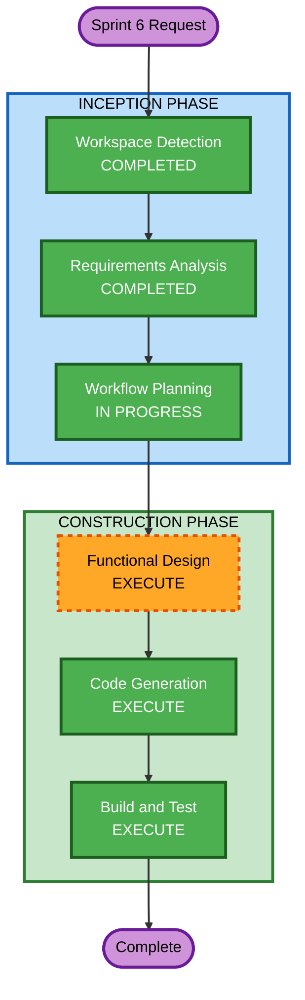

# Sprint 6 — Execution Plan

## Detailed Analysis Summary

### Transformation Scope
- **Transformation Type**: Architectural — cross-cutting multi-tenancy concern
- **Primary Changes**: Add tenant_id to all entities, tenant-aware repositories/services, Keycloak Organizations integration, per-tenant URL frontend deployment, CLI provisioning script
- **Related Components**: All backend modules (auth, user, class, testscore, subject, feedback, notification, report, testpaper, progress), frontend auth service, Keycloak realm config

### Change Impact Assessment
- **User-facing changes**: Yes — per-tenant URLs, org-scoped login via kc_org hint
- **Structural changes**: Yes — TenantContext holder, tenant-aware BaseEntity, all repositories updated
- **Data model changes**: Yes — new tenants table, tenant_id FK on ~20 tables, fresh schema (existing data wiped)
- **API changes**: No — API contracts unchanged (tenant_id derived from JWT, never in request/response)
- **NFR impact**: Yes — composite indexes with tenant_id leading column, tenant resolution caching

### Component Relationships
- **Primary Components**: auth module (TenantContext, JWT extraction), common module (TenantAwareBaseEntity)
- **Dependent Components**: ALL feature modules (user, class, testscore, subject, feedback, notification, report, testpaper, progress)
- **Infrastructure Components**: Keycloak realm config, Flyway migrations, provisioning script
- **Frontend Components**: keycloakService.ts (kc_org param), TenantContext provider, Navbar (center name display)

### Risk Assessment
- **Risk Level**: High — system-wide change touching every entity and query
- **Rollback Complexity**: Moderate — schema migration is destructive (data wipe), but code changes are reversible
- **Testing Complexity**: Complex — every endpoint needs tenant isolation verification

## Workflow Visualization

## Phases to Execute

### INCEPTION PHASE
- [x] Workspace Detection — COMPLETED
- [x] Requirements Analysis — COMPLETED
- [x] Workflow Planning — IN PROGRESS
- [ ] User Stories — SKIP
  - **Rationale**: Existing personas and stories from Sprint 1 still apply. Multi-tenancy is an architectural change, not a new user-facing feature. No new user journeys.
- [ ] Application Design — SKIP
  - **Rationale**: No new components or services. Existing module structure is preserved. Changes are within existing component boundaries (adding tenant_id to existing entities/repos/services).
- [ ] Units Generation — SKIP
  - **Rationale**: Single unit of work — all changes are tightly coupled (schema + entities + repos + services + auth + frontend must change together). No meaningful decomposition.

### CONSTRUCTION PHASE (Single Unit: Multi-Tenant Data Segregation)
- [ ] Functional Design — EXECUTE
  - **Rationale**: Significant data model changes (tenants table, tenant_id on ~20 tables), new business rules (tenant isolation enforcement), updated domain entities. Needs detailed design before code generation.
- [ ] NFR Requirements — SKIP
  - **Rationale**: NFR requirements from Sprint 1 still apply. Performance considerations (indexes, caching) are covered in the requirements doc. No new tech stack decisions.
- [ ] NFR Design — SKIP
  - **Rationale**: Existing NFR design patterns (caching, error handling, logging) still apply. Tenant resolution caching is a minor addition, not a new pattern.
- [ ] Infrastructure Design — SKIP
  - **Rationale**: No infrastructure changes in this sprint. CloudFront per-tenant URL setup is a deployment concern, not an app infrastructure change.
- [ ] Code Generation — EXECUTE (ALWAYS)
  - **Rationale**: Implementation of all multi-tenancy changes across backend, frontend, Keycloak config, and provisioning script.
- [ ] Build and Test — EXECUTE (ALWAYS)
  - **Rationale**: Comprehensive build and test instructions needed for tenant isolation verification.

## Extension Compliance
| Extension | Status | Rationale |
|---|---|---|
| Security Baseline | Disabled | Disabled since Sprint 1 Requirements Analysis |

## Estimated Stages: 3 (Functional Design → Code Generation → Build and Test)

## Success Criteria
- Every API endpoint returns only data belonging to the authenticated user's tenant
- Keycloak Organizations integration works with kc_org login hint from per-tenant URLs
- Provisioning script successfully creates a new tenant end-to-end
- Existing functionality (classes, scores, feedback, reports, etc.) works identically within a tenant context
